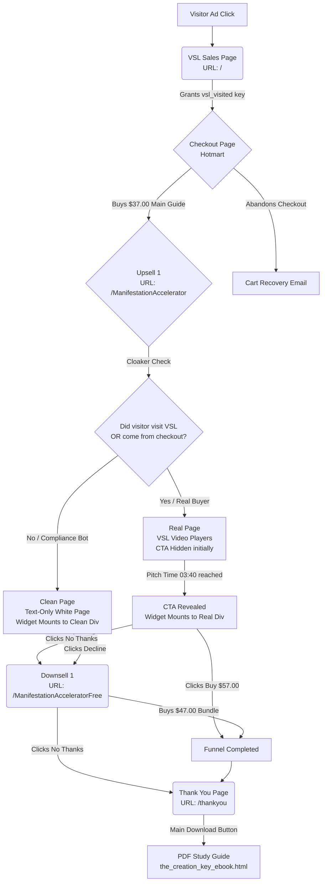

# The Creation Key — US Funnel Blueprint

Below is the complete structural map of your sales funnel, detailing the routing, cloaker logic, and user behavior flows.

## Funnel Flowchart

---

## Funnel Step Details

### 1. VSL Sales Page (`/`)
* **File:** [`index.html`](file:///C:/Mudar%20a%20Vida/Direct%20Response/Ofertas/08%20The%20Creation%20Key/Site/index.html)
* **Goal:** Pitch the main product (**The Creation Key**) via ConverteAI/VTurb video player.
* **Tracking/Cookies:** Sets `localStorage.setItem('vsl_visited', 'true')` immediately upon loading to validate future upsell views.

### 2. Upsell 1 (`/ManifestationAccelerator`)
* **File:** [`ManifestationAccelerator.html`](file:///C:/Mudar%20a%20Vida/Direct%20Response/Ofertas/08%20The%20Creation%20Key/Site/ManifestationAccelerator.html)
* **Cloaker Logic:**
  * If the browser has `vsl_visited === 'true'` OR `document.referrer` contains `sacredcoderevealed.com`, `hotmart.com` or `kashpay.com.br`, it displays the **Real VSL Page**.
  * Otherwise, it displays the **Clean White Page** with a text-only description and compliant Hotmart checkout widget to bypass compliance scans.
* **Dynamic ID Swapping:** To prevent duplicate ID conflicts inside the DOM, the script dynamically assigns the ID `hotmart-sales-funnel` strictly to the active visible container (Clean container for reviewers, Real container for buyers) before mounting the Hotmart Sales Funnel widget.
* **CTA Delay:** The content below the video player starts hidden in `
` and is automatically made visible by VTurb at **03:40** (3m40s).
* **Decline URL:** Redirects to `/ManifestationAcceleratorFree`.

### 3. Downsell 1 (`/ManifestationAcceleratorFree`)
* **File:** [`ManifestationAcceleratorFree.html`](file:///C:/Mudar%20a%20Vida/Direct%20Response/Ofertas/08%20The%20Creation%20Key/Site/ManifestationAcceleratorFree.html)
* **Goal:** Offer the Manifestation Accelerator for **FREE** if they purchase the Subconscious Divine Frequencies for **$47.00**.
* **Guarantee:** High-converting triple guarantee (Full refund + $100 cash out of pocket if results fail).
* **Widget:** Embeds the Hotmart widget container with `id="hotmart-sales-funnel"`.
* **Decline URL:** Redirects to `/thankyou`.

### 4. Thank You Page (`/thankyou`)
* **File:** [`thankyou.html`](file:///C:/Mudar%20a%20Vida/Direct%20Response/Ofertas/08%20The%20Creation%20Key/Site/thankyou.html)
* **Goal:** Confirm the purchase, show the updated parchment-style cover (`the_creation_key_cover.jpg`), and link to the printable PDF workbook ([`the_creation_key_ebook.html`](file:///C:/Mudar%20a%20Vida/Direct%20Response/Ofertas/08%20The%20Creation%20Key/Site/the_creation_key_ebook.html)).
* **Notice:** Contains mobile application server transition warnings (anti-chargeback protection).
